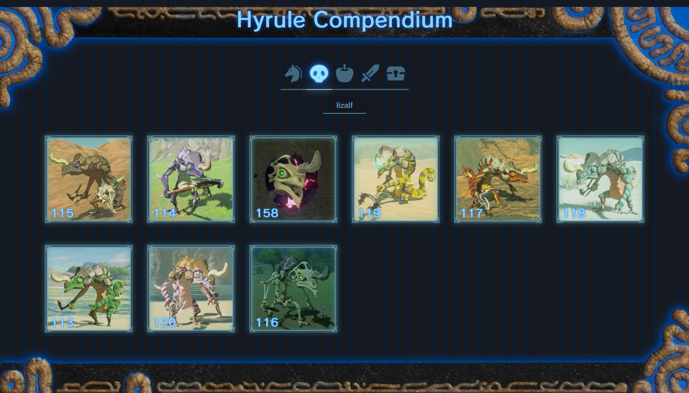

# Hyrule Compendium Explorer



## Descripción

Hyrule Compendium Explorer es una página estática web para buscar y explorar entradas del compendio de *The Legend of Zelda: Breath of the Wild*. El **objetivo principal** de este proyecto fue profundizar un poco más en **JavaScript** y **CSS**. El **objetivo secundario** es servir como un **taller** para practicar el desarrollo web consumiendo una API externa.

## Requisitos

- Navegador moderno (Chrome, Firefox, etc.).
- Conexión a Internet para la API (`https://botw-compendium.herokuapp.com`).
- Node.js o Python para servir los archivos.

## Cómo Ejecutar

### 1. Con `serve` (Node.js)
1. Instala `serve`:
   ```bash
   npm install -g serve
   ```
2. En el directorio del proyecto:
   ```bash
   serve
   ```
3. Abre `http://localhost:3000`.

### 2. Con Python HTTP Server
1. En el directorio del proyecto:
   ```bash
   python3 -m http.server 8000
   ```
2. Abre `http://localhost:8000`.

## Uso

- **Filtrar**: Selecciona categorías (criaturas, monstruos, etc.) con las casillas.
- **Buscar**: Escribe (mínimo 3 caracteres) para buscar entradas.
- **Detalles**: Clic en una entrada para ver descripción, ubicaciones y botín.
- **Cerrar**: Usa el botón "Close" para volver.

## Estructura

- `resources/`: Recursos gráficos.
- `scripts/`: Lógica separada en archivos (`api.js`, `ui.js`, `search.js`, etc.).
- `styles/`: Estilos CSS.
- `index.html`: Página principal.
- `entries.json`: Nombres de entradas para la API con el fin de buscar más rápido.
